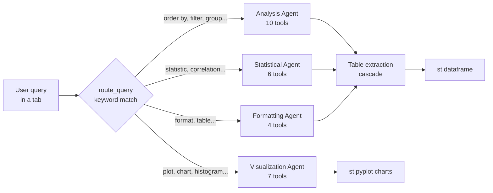

# Multi-Agent Data Analysis System

A Streamlit application that turns natural-language questions about uploaded CSV/Excel data into statistics, SQL-like queries, and charts, using specialist agents built on the OpenAI Agents SDK.

Upload one or more data files, then work through five tabs (Statistics, Data Analysis, Visualizations, Feature Relationships, AI Chat). Each question is routed to a specialist agent whose function tools are plain pandas/scipy/matplotlib operations over the loaded dataframe. Results are returned as tables wherever tabular structure can be recovered, with charts rendered inline. Intended for analysts who want ad-hoc exploration of a dataset without writing pandas code.

## Architecture at a glance

- **Orchestration pattern:** a deterministic keyword router (`route_query` in `data-insights.py`) dispatches each query to exactly one specialist agent, which then runs a single-agent tool loop via `Runner.run_sync`. Runs are synchronous and sequential — one agent, one run, per query. Five `Agent` objects are constructed: Analysis, Statistical, Visualization, Formatting, and Orchestrator; the Orchestrator agent is defined but not currently invoked (routing is done in Python, not by an LLM, and no handoffs are configured).
- **Model/framework:** OpenAI Agents SDK (`openai-agents>=0.6.0`) over the OpenAI API. No model is pinned in code — `Agent(...)` is created without a `model` argument, so the installed SDK's default OpenAI model is used. (`create_agents` accepts a `model_name` parameter, but it is never applied.)
- **Memory/session state:** Streamlit `st.session_state` holds the combined dataframe and the agent instances; `@st.cache_data` caches file loading. Individual agent runs are stateless — no conversation history is carried between queries.
- **Retrieval:** none. Context is engineered directly: the dataframe's column list is embedded into each agent's instructions at creation time, and tools return stringified dataframe output.



See [docs/ARCHITECTURE.md](docs/ARCHITECTURE.md) for the full component map, [docs/EVALUATION.md](docs/EVALUATION.md) for what is and is not tested, and [docs/HARDENING.md](docs/HARDENING.md) for the path to production.

## Quickstart

Requires Python 3.9+ and an OpenAI API key.

```bash
git clone https://github.com/git-bonda108/multi-agent-data-analysis.git
cd multi-agent-data-analysis

# One-shot setup (creates venv, installs deps, writes a .env template):
./setup.sh

# Or manually:
python3 -m venv venv
source venv/bin/activate          # Windows: venv\Scripts\activate
pip install -r requirements.txt

# Add your key:
echo 'OPENAI_API_KEY=your-openai-api-key-here' > .env

# Run:
source venv/bin/activate
python -m streamlit run data-insights.py
```

Expected output:

```
  You can now view your Streamlit app in your browser.

  Local URL: http://localhost:8501
```

Open the URL, upload a CSV or Excel file in the sidebar, and the five analysis tabs appear. Without `OPENAI_API_KEY` set, the app stops at an error screen explaining how to set it. Deterministic features (data preview, quality summary, quick correlation/statistics buttons) work from local computation; agent-driven queries call the OpenAI API and require credit on the key.

## Configuration

| Variable | Required | What it is | Where to get it |
|---|---|---|---|
| `OPENAI_API_KEY` | Yes | OpenAI API key used by the Agents SDK for all agent runs. Read via `.env` (python-dotenv) or the process environment; on Streamlit Community Cloud, set it under app Settings → Secrets. | https://platform.openai.com/api-keys |

This is the only environment variable the application reads.

## Repository layout

```
data-insights.py            # Streamlit app: UI, agent construction, routing, result extraction
tools/
  data_tools.py             # Querying, filtering, grouping, outliers, data quality
  statistical_tools.py      # Descriptive stats, correlations, ANOVA, hypothesis tests
  visualization_tools.py    # matplotlib/seaborn charts rendered via st.pyplot
  formatting_tools.py       # Coercing results into DataFrame tables
  advanced_data_tools.py    # SQL-like query helpers (currently not imported by the app)
test_order_data.py          # Script-style smoke test of the tools layer
setup.sh                    # venv + dependency + .env bootstrap
requirements.txt
docs/                       # ARCHITECTURE.md, EVALUATION.md, HARDENING.md
```

The other Markdown files at the repository root (`CODE_DOCUMENTATION.md`, `TEST_CASES*.md`, `PLAN_SUMMARY.md`, etc.) are working notes and manual test checklists from the original development; the `docs/` directory is the maintained documentation.

## License

No license file is present; all rights reserved by default. Open an issue on GitHub for questions.
